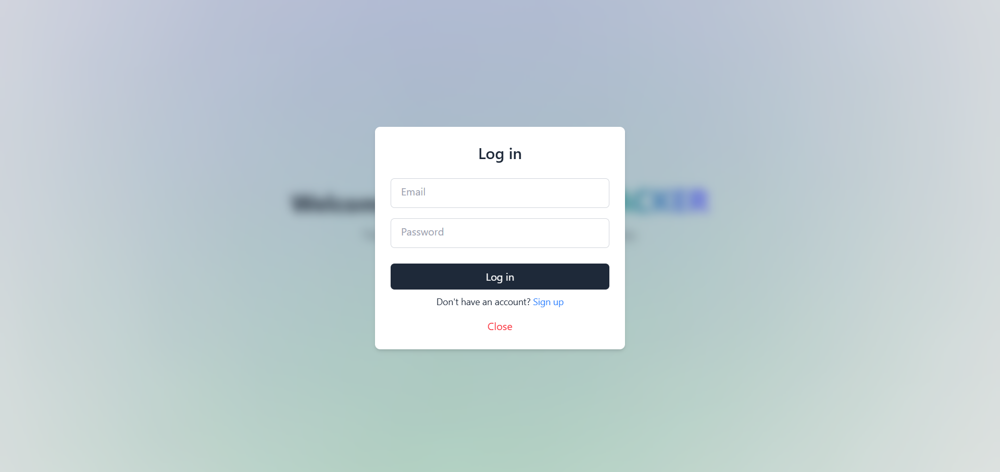
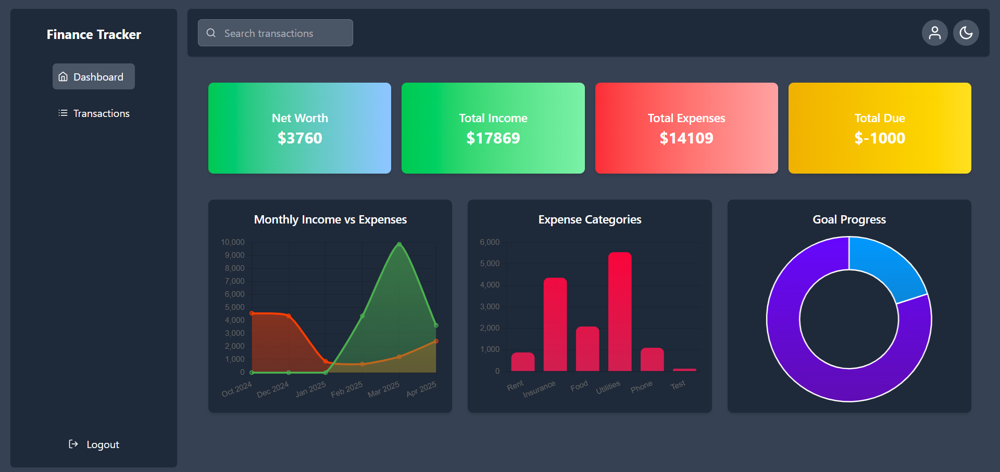
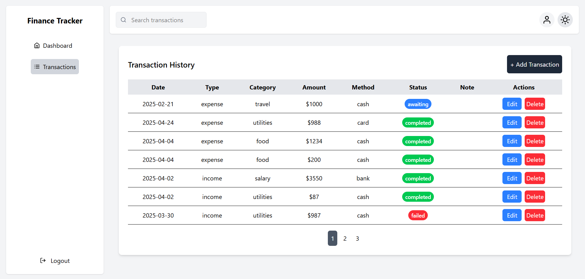
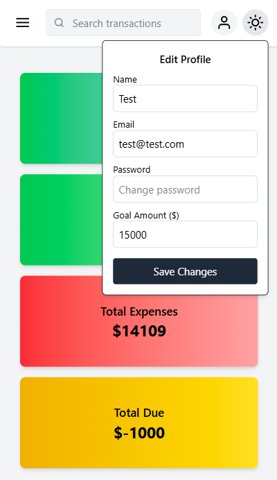

# Finance Tracker Frontend

A simple web application that helps users track their personal finances by logging transactions, visualizing analytics, and monitoring spending goals — built with React.

## Contents

- [Features](#features)  
- [Tech Stack](#tech-stack)  
- [Getting Started](#getting-started)   
- [Screenshots](#screenshots)  

## Features

- User authentication (register, login, logout)
- Profile update (email, password, name, goal)
- Add income and expenses
- Categorize transactions (salary, bills, custom, etc.)
- Monthly analytics: income vs expenses
- Category analytics: expenses
- Net worth and goal tracking
- Transaction history table with search option
- Responsive and modern UI

## Tech Stack

- **React** + **Vite**
- **Tailwind CSS** for styling

## Getting Started

### Prerequisites

- Node.js & npm

### Clone the Repo

```bash
git clone https://github.com/vesc0/finance-tracker-frontend
cd finance-tracker-frontend
```

### Setup

```bash
cd frontend
npm install
npm run dev
```

## Screenshots

<p align="center">
  
</p>

---

<p align="center">
  
</p>

---

<p align="center">
  
</p>

---

<p align="center">
  
</p>